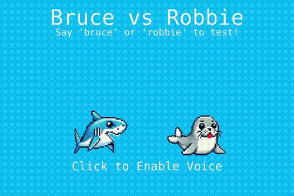

# cognigy-hackathon-2025
Ready to ouh?

<p align="center">
    
</p>

This is a hackathon project built mostly with AI coding assistant.

# How to play
To start the game run following in the terminal/console:

```sh
npm install
npm run dev
```

Open the link you see in your browser and follow the instructions on the screen. If voice recognition does not properly so well for you, you can also control the shark and seal by pression left and right arrow keys on the keyboard.
